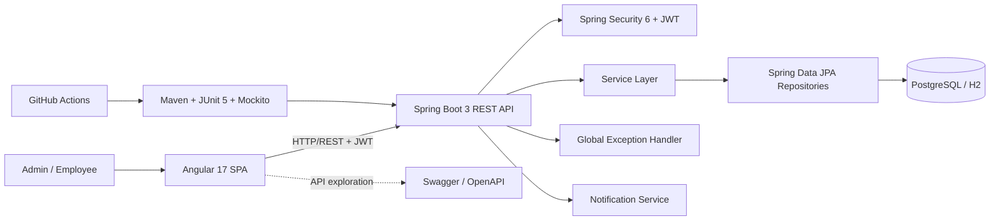
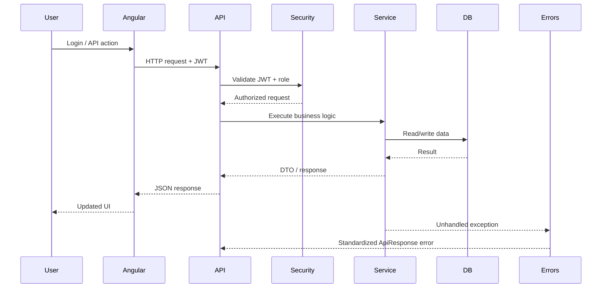
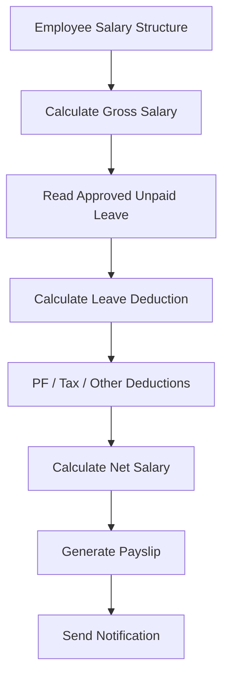
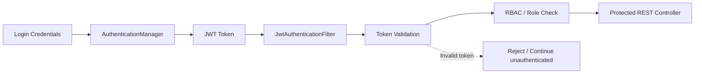
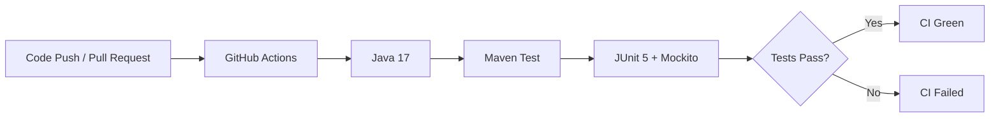
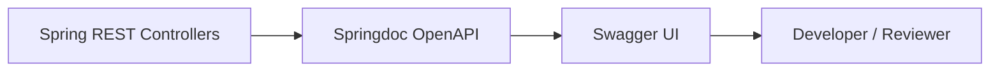

# PayCore Architecture & Engineering Overview

## High-Level Architecture

## Request Flow

## Payroll Flow

## Security Flow

## Testing & CI Flow

## API Documentation Flow

## Layer Responsibilities

| Layer | Responsibility |
|---|---|
| Angular | UI, routing, forms, HTTP calls, role-based views |
| Controller | REST endpoints and request/response handling |
| Exception Handler | Centralized validation and REST error responses |
| Service | Payroll, leave, employee and notification business rules |
| Repository | Database access through Spring Data JPA |
| Entity | Persistent domain model |
| Security | JWT authentication, authorization and RBAC |
| OpenAPI | Interactive REST API documentation |
| Tests | Regression protection for business and security flows |
| CI | Automated backend build/test validation |
